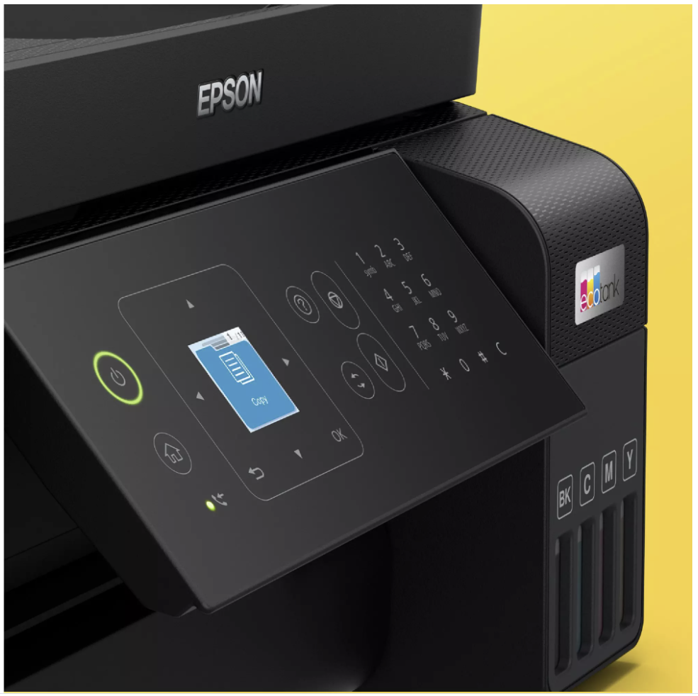
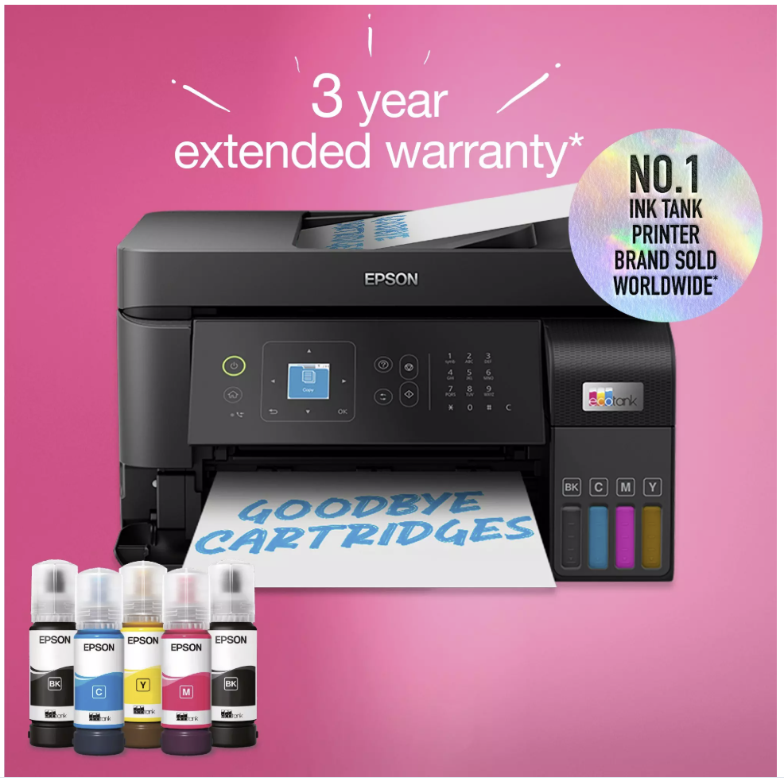
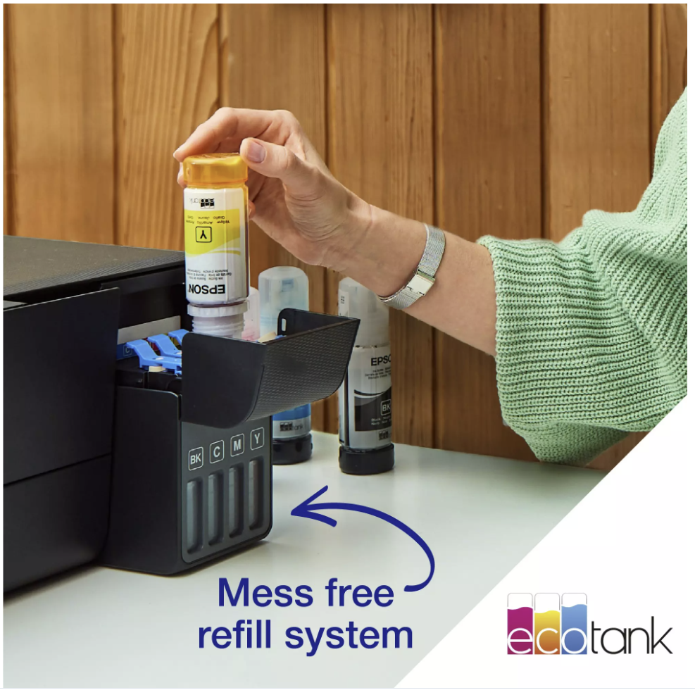
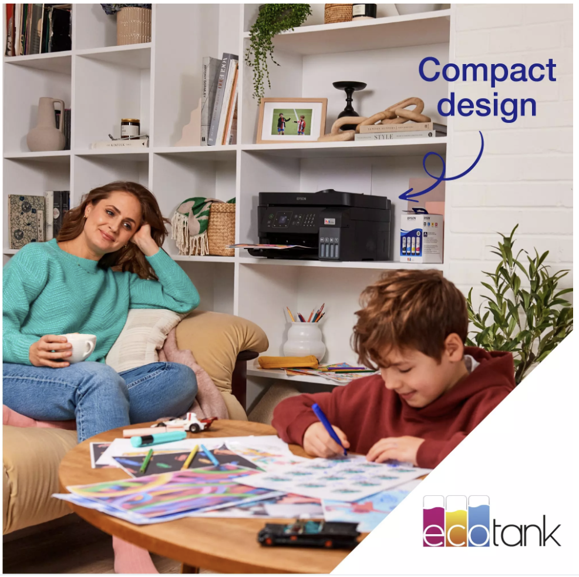
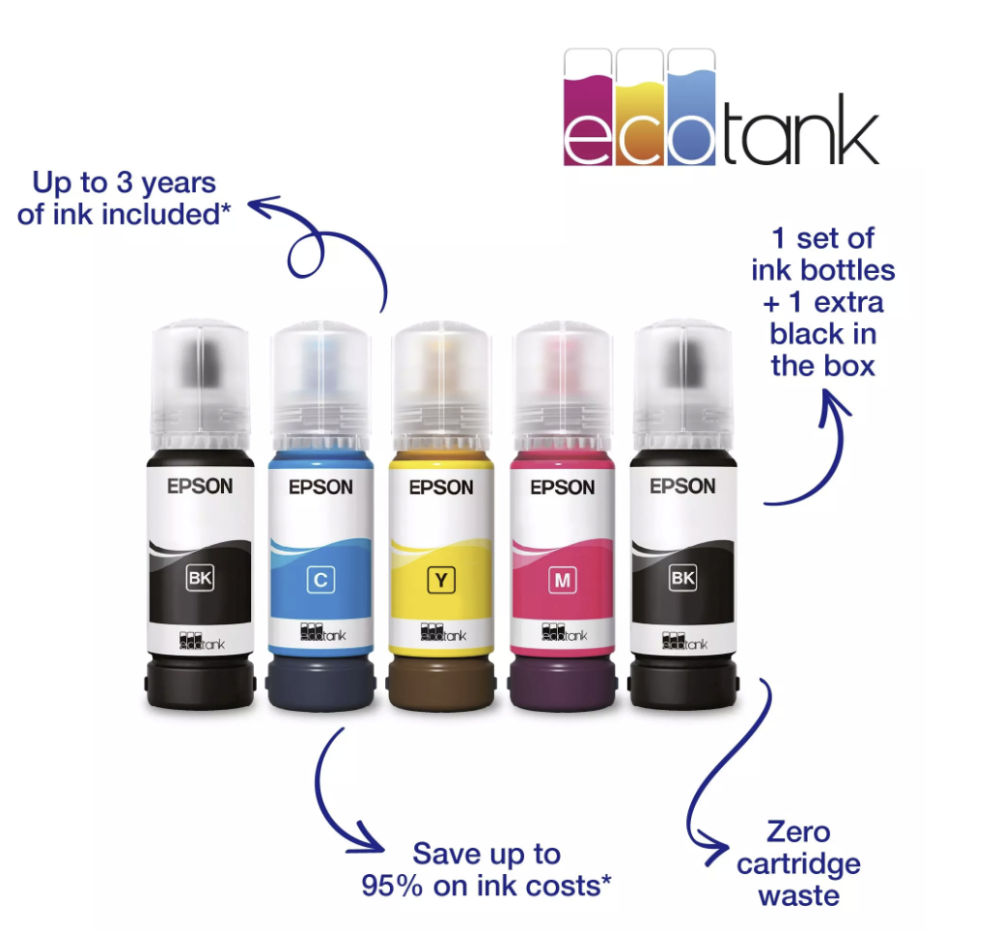
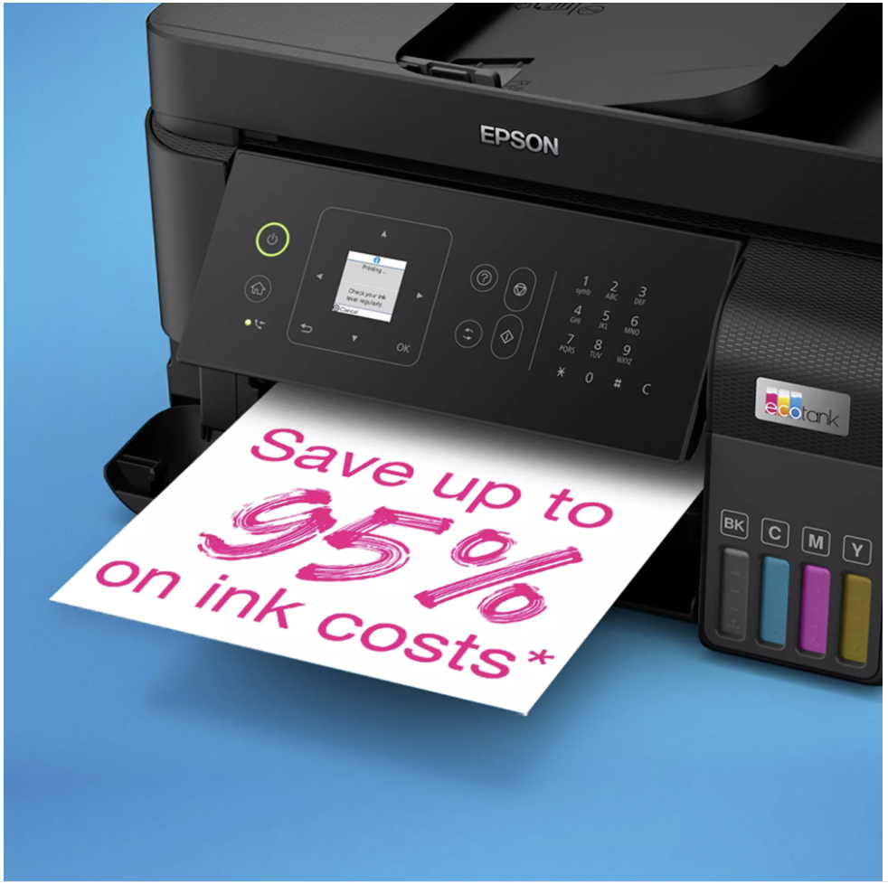
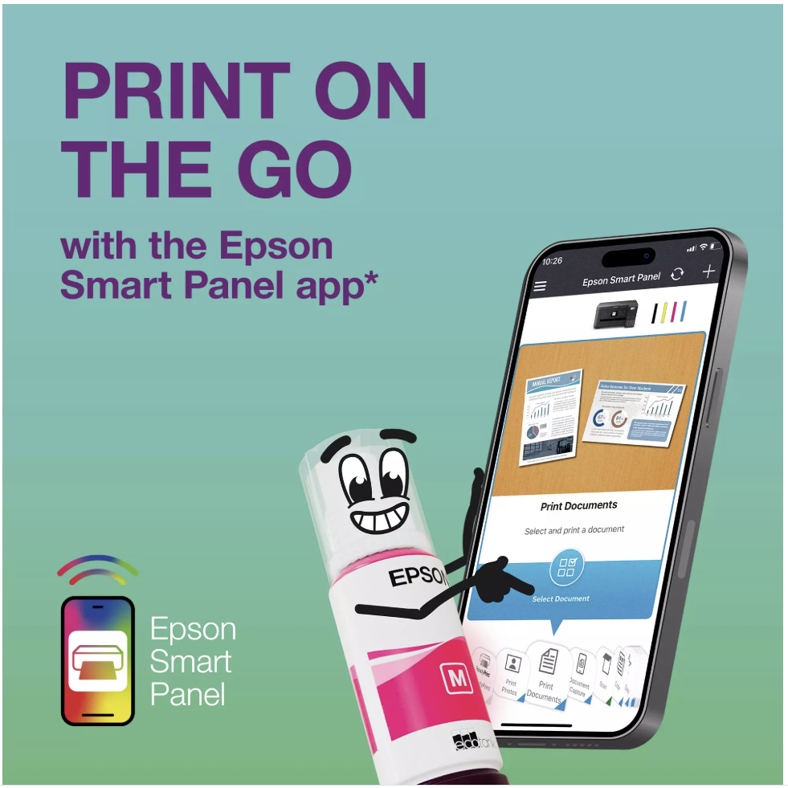
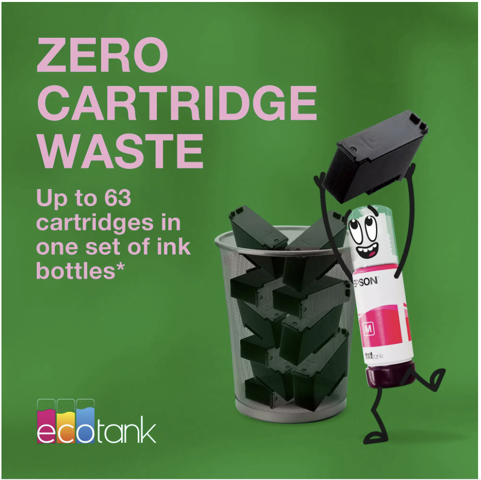
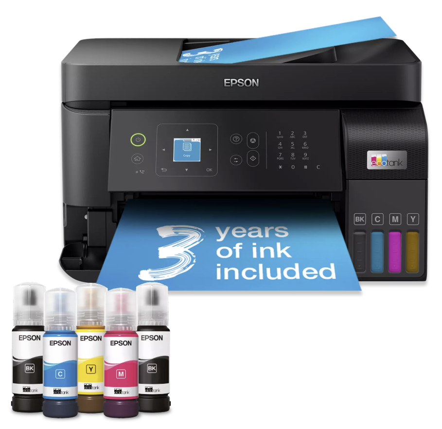
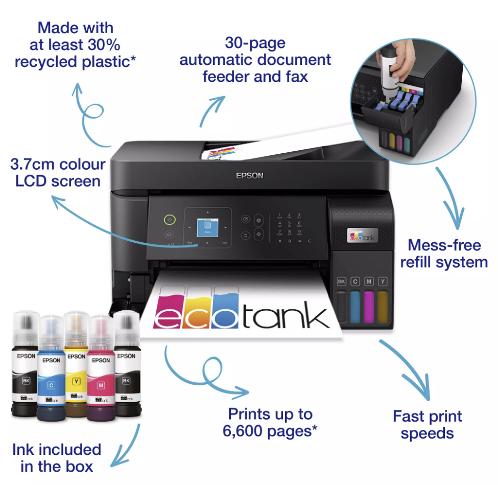

# Pipeline Results — Alt-Text Generation Output

> **Last run:** 10 February 2026
> **Model:** Phi-4-multimodal-instruct via Azure AI Foundry
> **Source:** public website
> **Languages:** EN, JP, NL, FR

---

## Results Table

All images are from the Epson EcoTank L3560 product listing. Each image was uploaded with a YAML sidecar containing product metadata, processed by the Phi-4 pipeline, and translated into four languages via Azure AI Translator.

| Image | Pipeline Output |
|:---:|---|
|  | <pre lang="json">{<br>  "asset": "img_0.png",<br>  "image": "img_0.png",<br>  "source": "public website",<br>  "altText": {<br>    "en": "Colorful Epson ink tank printer.",<br>    "jp": "カラフルなエプソンインクタンクプリンター。",<br>    "nl": "Kleurrijke Epson inkttankprinter.",<br>    "fr": "Imprimante Epson colorée pour réservoir d'encre."<br>  },<br>  "generatedAt": "2026-02-10T12:23:52+00:00"<br>}</pre> |
|  | <pre lang="json">{<br>  "altText": {<br>    "en": "Epson ink tank printer ecoTank L3560 a4 multifunction printer.",<br>    "jp": "エプソンのインクタンクプリンター、ecoTank L3560 a4、多機能プリンター。",<br>    "nl": "Epson inkttankprinter ecoTank L3560 a4 multifunctionele printer.",<br>    "fr": "Imprimante à réservoir d'encre Epson EcoTank L3560 A4 imprimante multifonction."<br>  }<br>}</pre> |
|  | <pre lang="json">{<br>  "altText": {<br>    "en": "Hand refilling ink tank with ink bottles.",<br>    "jp": "インク瓶でインクタンクを手作業で補充しましょう。",<br>    "nl": "Inkttank met de hand bijvullen met inktflessen.",<br>    "fr": "Rechargez le réservoir d'encre à la main avec des bouteilles d'encre."<br>  }<br>}</pre> |
|  | <pre lang="json">{<br>  "altText": {<br>    "en": "Compact ink tank printer in black Epson EcoTank L3560.",<br>    "jp": "黒のコンパクトインクタンクプリンター Epson EcoTank L3560。",<br>    "nl": "Compacte inkttankprinter in zwart Epson EcoTank L3560.",<br>    "fr": "Imprimante compacte à encre en noir Epson EcoTank L3560."<br>  }<br>}</pre> |
|  | <pre lang="json">{<br>  "altText": {<br>    "en": "Ink tank refill bottles in various colors.",<br>    "jp": "さまざまな色のインクタンク補充ボトル。",<br>    "nl": "Inkttankflessen in verschillende kleuren.",<br>    "fr": "Bouteilles de recharge pour réservoir d'encre de différentes couleurs."<br>  }<br>}</pre> |
|  | <pre lang="json">{<br>  "altText": {<br>    "en": "Epson eco tank ink cost savings.",<br>    "jp": "エプソン・エコタンクインクのコスト削減。",<br>    "nl": "Epson Eco tank inkt bespaart kosten.",<br>    "fr": "Économies de coûts pour l'encre Epson Eco Tank."<br>  }<br>}</pre> |
|  | <pre lang="json">{<br>  "altText": {<br>    "en": "Print on the go with the epson smart panel app.",<br>    "jp": "エプソンのスマートパネルアプリで持ち帰りながら印刷できます。",<br>    "nl": "Print onderweg met de Epson Smart Panel-app.",<br>    "fr": "Imprimez en déplacement avec l'application Epson Smart Panel."<br>  }<br>}</pre> |
|  | <pre lang="json">{<br>  "altText": {<br>    "en": "Ink bottle with black ink cartridge in a trash can.",<br>    "jp": "ゴミ箱の中の黒インクカートリッジ入りインク瓶。",<br>    "nl": "Inktfles met zwarte inktcartridge in een prullenbak.",<br>    "fr": "Encrier avec cartouche noire dans une poubelle."<br>  }<br>}</pre> |
|  | <pre lang="json">{<br>  "altText": {<br>    "en": "Epson EcoTank L3560 multifunction ink tank printer in black with 3 years of ink included.",<br>    "jp": "Epson EcoTank L3560 マルチファンクションインクタンクプリンター(黒、3年分のインク同梱)。",<br>    "nl": "Epson EcoTank L3560 multifunctionele inkttankprinter in zwart met 3 jaar inkt inbegrepen.",<br>    "fr": "Epson EcoTank L3560 imprimante multifonction pour réservoir d'encre noire avec 3 ans d'encre incluse."<br>  }<br>}</pre> |
|  | <pre lang="json">{<br>  "altText": {<br>    "en": "Inkjet printer with ecotank ink cartridges.",<br>    "jp": "エコタンクインクカートリッジ付きのインクジェットプリンター。",<br>    "nl": "Inkjetprinter met Ecotank-inktcartridges.",<br>    "fr": "Imprimante jet d'encre avec cartouches d'encre ecotank."<br>  }<br>}</pre> |

---

## Translations

<details>
<summary><strong>img_0.png</strong> — Colorful Epson ink tank printer.</summary>

| Language | Translation |
|---|---|
| EN | Colorful Epson ink tank printer. |
| JP | カラフルなエプソンインクタンクプリンター。 |
| NL | Kleurrijke Epson inkttankprinter. |
| FR | Imprimante Epson colorée pour réservoir d'encre. |

</details>

<details>
<summary><strong>img_1.png</strong> — Epson ink tank printer ecoTank L3560 a4 multifunction printer.</summary>

| Language | Translation |
|---|---|
| EN | Epson ink tank printer ecoTank L3560 a4 multifunction printer. |
| JP | エプソンのインクタンクプリンター、ecoTank L3560 a4、多機能プリンター。 |
| NL | Epson inkttankprinter ecoTank L3560 a4 multifunctionele printer. |
| FR | Imprimante à réservoir d'encre Epson EcoTank L3560 A4 imprimante multifonction. |

</details>

<details>
<summary><strong>img_2.png</strong> — Hand refilling ink tank with ink bottles.</summary>

| Language | Translation |
|---|---|
| EN | Hand refilling ink tank with ink bottles. |
| JP | インク瓶でインクタンクを手作業で補充しましょう。 |
| NL | Inkttank met de hand bijvullen met inktflessen. |
| FR | Rechargez le réservoir d'encre à la main avec des bouteilles d'encre. |

</details>

<details>
<summary><strong>img_3.png</strong> — Compact ink tank printer in black Epson EcoTank L3560.</summary>

| Language | Translation |
|---|---|
| EN | Compact ink tank printer in black Epson EcoTank L3560. |
| JP | 黒のコンパクトインクタンクプリンター Epson EcoTank L3560。 |
| NL | Compacte inkttankprinter in zwart Epson EcoTank L3560. |
| FR | Imprimante compacte à encre en noir Epson EcoTank L3560. |

</details>

<details>
<summary><strong>img_4.png</strong> — Ink tank refill bottles in various colors.</summary>

| Language | Translation |
|---|---|
| EN | Ink tank refill bottles in various colors. |
| JP | さまざまな色のインクタンク補充ボトル。 |
| NL | Inkttankflessen in verschillende kleuren. |
| FR | Bouteilles de recharge pour réservoir d'encre de différentes couleurs. |

</details>

<details>
<summary><strong>img_5.png</strong> — Epson eco tank ink cost savings.</summary>

| Language | Translation |
|---|---|
| EN | Epson eco tank ink cost savings. |
| JP | エプソン・エコタンクインクのコスト削減。 |
| NL | Epson Eco tank inkt bespaart kosten. |
| FR | Économies de coûts pour l'encre Epson Eco Tank. |

</details>

<details>
<summary><strong>img_6.png</strong> — Print on the go with the epson smart panel app.</summary>

| Language | Translation |
|---|---|
| EN | Print on the go with the epson smart panel app. |
| JP | エプソンのスマートパネルアプリで持ち帰りながら印刷できます。 |
| NL | Print onderweg met de Epson Smart Panel-app. |
| FR | Imprimez en déplacement avec l'application Epson Smart Panel. |

</details>

<details>
<summary><strong>img_7.png</strong> — Ink bottle with black ink cartridge in a trash can.</summary>

| Language | Translation |
|---|---|
| EN | Ink bottle with black ink cartridge in a trash can. |
| JP | ゴミ箱の中の黒インクカートリッジ入りインク瓶。 |
| NL | Inktfles met zwarte inktcartridge in een prullenbak. |
| FR | Encrier avec cartouche noire dans une poubelle. |

</details>

<details>
<summary><strong>img_8.png</strong> — Epson EcoTank L3560 multifunction ink tank printer in black with 3 years of ink included.</summary>

| Language | Translation |
|---|---|
| EN | Epson EcoTank L3560 multifunction ink tank printer in black with 3 years of ink included. |
| JP | Epson EcoTank L3560 マルチファンクションインクタンクプリンター(黒、3年分のインク同梱)。 |
| NL | Epson EcoTank L3560 multifunctionele inkttankprinter in zwart met 3 jaar inkt inbegrepen. |
| FR | Epson EcoTank L3560 imprimante multifonction pour réservoir d'encre noire avec 3 ans d'encre incluse. |

</details>

<details>
<summary><strong>img_10.png</strong> — Inkjet printer with ecotank ink cartridges.</summary>

| Language | Translation |
|---|---|
| EN | Inkjet printer with ecotank ink cartridges. |
| JP | エコタンクインクカートリッジ付きのインクジェットプリンター。 |
| NL | Inkjetprinter met Ecotank-inktcartridges. |
| FR | Imprimante jet d'encre avec cartouches d'encre ecotank. |

</details>

---

## Output JSON Structure

Each `.alt.json` sidecar contains:

```json
{
  "asset": "img_0.png",
  "image": "img_0.png",
  "source": "public website",
  "altText": {
    "en": "Colorful Epson ink tank printer.",
    "jp": "カラフルなエプソンインクタンクプリンター。",
    "nl": "Kleurrijke Epson inkttankprinter.",
    "fr": "Imprimante Epson colorée pour réservoir d'encre."
  },
  "generatedAt": "2026-02-10T12:23:52+00:00"
}
```

Fields:
- **asset** — original asset filename from YAML sidecar
- **image** — blob name in storage
- **source** — source system (determines which system prompt is used)
- **altText** — generated alt text in each requested language
- **generatedAt** — ISO 8601 timestamp of generation

---

## Summary Statistics

| Metric | Value |
|---|---|
| Total images processed | 10 |
| Success rate | 100 % (10/10) |
| Prompting strategy | 4-shot learning (public website prompt) |
| Response format | Plain text (model returns alt text directly) |
| Punctuation | Normalized (capital start, full stop ending) |

## Observations

**What went well:**
- All 10 images were processed end-to-end without errors
- Translations were generated in all four target languages (EN, JP, NL, FR) via Azure AI Translator with Managed Identity
- Descriptions are generally visually accurate and concise
- Punctuation normalization ensures consistent formatting (capital letter, trailing full stop)
- Plain text response format (instead of JSON) gives the model more token budget for quality descriptions

**Areas for improvement:**
- img_5 ("Epson eco tank ink cost savings.") describes text on screen rather than the visual scene — the model read and repeated overlay text
- img_7 ("Ink bottle with black ink cartridge in a trash can.") misinterprets the visual — the image shows an EcoTank bottle next to traditional cartridges to illustrate cost savings, not items in a trash can
- Some images lack brand+model (e.g., img_2 "Hand refilling ink tank with ink bottles." — no Epson/EcoTank mention). The system prompt encourages this but the model doesn't always comply
- img_0 is quite short at 32 characters ("Colorful Epson ink tank printer.") — below the 80-char guideline

---

## How to Reproduce

Upload the test images and collect results:

```bash
# Deploy and run pipeline
./scripts/04-test-end-to-end.sh

# Results are saved to the results/ directory
ls results/*.alt.json

# Or download from Azure Storage
source scripts/utils.sh
ingest-list
```

The raw JSON results are stored in [results/](../results/).

---

## Related Documentation

- [System Design](system-design.md) — Architecture and components
- [AI Prompt Design](ai-prompt-design.md) — How context and prompts are assembled for Phi-4
- [Security Architecture](security-architecture.md) — Authentication model
